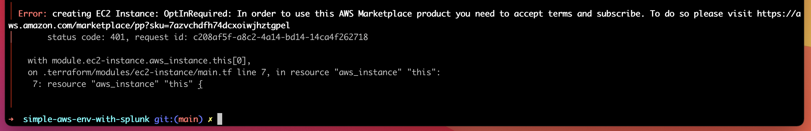

# Simple AWS Environment with Splunk installed

This Terraform configuration allows you to spin up a simple AWS environment, consisting of a single VPC in a region of choice, one private subnet,
and one public subnet. The public subnet hosts a single EC2 instance with a Splunk AMI. Furthermore, the environment contains a security group, which
allows all outbound traffic and inbound traffic for ports 22, 80, 443, and 8000.


<span style="color:red">**Important information** *(stand October 19, 2022)*:</span> Please don't use this AWS environment with Splunk instance to process sensible data. I did not (yet) implement the necessary security mechanisms and install the necessary certificates. The connection to the Splunk Search head is via HTTP by default, however, this can be toggled to HTTPS in the Splunk Server Settings. 

## Prerequisites
- An AWS account.
- An AWS Marketplace subscription for the Splunk Enterprise AMI (If you don't have that yet, don't worry, I will briefly mention what to do in the *Special case* part of the  **Start up the environment** section).
- A public key for AWS EC2.

## Set Up
Clone this repository to a convenient location on your file system and in a terminal navigate to the root level of it.
Copy the *terraform.tfvars.example* and remove the '.example' extension from the copy.

```console
~$ cp terraform.tfvars.example terraform.tfvars
```

In the now *terraform.tfvars* edit the variables:

- Set 'aws_access_key_id' and 'aws_secret_access_key' according to your own Access Key that is connected to your AWS user.
- For the EC2 instance, create a key, either with OpenSSL or via the AWS GUI, and set 'key_name' to the name you gave that key.

Edit the remaining variables specific to the AWS infrastructure accordingly.
For example, the following configuration will spin up a VPC with the name "my-vpc" in the "eu-west-1" region (Ireland). The public subnet of that VPC will host an EC2 instance of type "t2.small" with a size of 20 GiB.
<br>

```
# AWS Infrastructure Settings ##

# VPC Name 
vpc_name = "my-vpc"

/*
Please select an AZ: 
    1:eu-west-1, 2:eu-west-3, 3:eu-central-1, 4:us-east-1, 
    5:us-east-2, 6:us-west-1, 7:us-west-2, 8:ap-southeast-1, 
    9:ap-southeast-2, 10:sa-east-1
*/
available_aws_regions = "1"

# Please select an EC2 instance type: 1:t2.micro, 2:t2.small, 3:t2.medium, 4:t2.large, 5:t2.xlarge, 6:t2.2xlarge
selected_ec2_instance_type = "2"

# Please enter a number for the EC2 instance volume size in GiB
root_block_volume_size = "20"
```

Notice that for the Availability Zone and the EC2 instance type, instead of entering the complete name, there is 
a single digit added. This digit acts as a key to the value that is the name of the AZ or instance type. 
This is due to the following reason: Alternatively, you can delete this part of the *terraform.tfvars* file. What would happen then is that you would be 
prompted to provide the input once you spin up the environment. And in this case, entering a single digit is a bit more
convenient than entering the whole name.

## Initialize Terraform

Once you are done with configuring the *terraform.tfvars* file, run the following command to initialize the repository for Terraform, and for 
downloading the required dependencies:

```console
~$ terraform init
```

If you have run the *init* command in the past and want to update the downloaded dependencies to the current versions, you can run the following command: 

```console
~$ terraform init -upgrade
```
 
## Start up the environment

### Create an execution plan (optional)
You can create an execution plan. This does not actually perform anything, it is only a way
for Terraform to, well, create a plan when the time comes when we are going to interact with the real AWS infrastructure.
For you it can be useful as a feedback of all the changes Terraform is going to apply. 
Here is the command:

```console
~$ terraform plan
```

### Apply the changes
Once ready, you can spin up the environment with the following command: 

```console
~$ terraform apply
```

If you haven't created an execution plan with the *plan* command in the previous step, don't worry,
Terraform will create it now automatically.

During the *apply*-process, you get prompted to confirm the changes by typing **yes**.
If you are impatient (like me), you can skip this confirmation by adding the following argument to the command:

```console
~$ terraform apply --auto-approve
```

As soon as the process finishes, you are presented with the EC2 Splunk URL, a username, and a password.
During the deployment of the AWS infrastrucutre, you can always output this information with:

```console
~$ terraform output
```

#### Special case
If you haven't yet subscribed for the WS Marketplace subscription for the Splunk Enterprise AMI, you will
be most likely greeted with an Error message like this:



This means that the environment is up and running, except for the EC2 instance with the Splunk AMI. In this
case please spin down the remaining resources with the *destroy* command shown in the **Shut down the environment**
section, follow the link in the error message, sign up for the Splunk AMI in the AWS console, and perform
the *appy* command again.

## Shut down the environment

You can destroy the AWS environment with the *destroy* command:

```console
~$ terraform destroy
```

Once again, you get prompted to confirm the changes by typing **yes**, which you can omit with this command:

```console
~$ terraform destroy --auto-approve
```