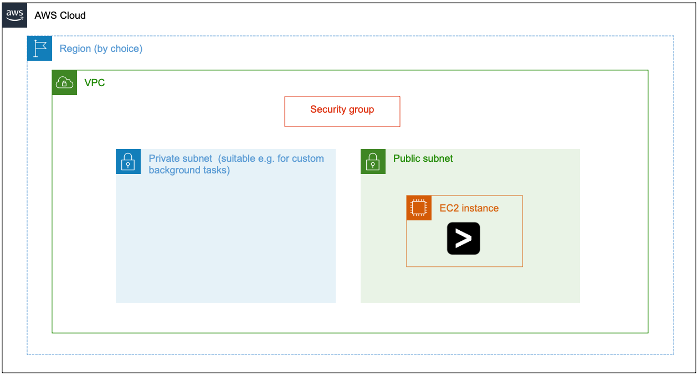

# Simple AWS Environment with Splunk installed

This Terraform configuration allows you to splin up a simple AWS environment, consisting of a single VPC in a region of choice, one private subnet,
and one public subnet. The public subnet hosts a single EC2 instance with a Splunk AMI. Furthermore, the environment contains a security group, which
allows all outbound traffic and inbound traffic for ports 22, 80, 443, and 8000.

**Important information** (stand October 19, 2022): Please don't use this AWS environment with Splunk instance to process sensible data. I did not (yet) implement the necessary security mechanisms and install the necessary certificates. The connection to the Splunk Search head is via HTTP by default, however, this can be toggled to HTTPS in the Splunk Server Settings. 

## Prerequisites
- An AWS account.
- A public key for AWS EC2.

## Set Up
Copy the 'terraform.tfvars.example' and remove the '.example' extension from the copy.
In the now 'terraform.tfvars' edit the variables:

- Set 'aws_access_key_id' and 'aws_secret_access_key' according to your own Access Key that is connected to your AWS user.
- For the EC2 instance, create a key, either with OpenSSL or via the AWS GUI, and set 'key_name' to the name you gave that key.

Edit the remaining variables specific to the AWS infrastructure accordingly.